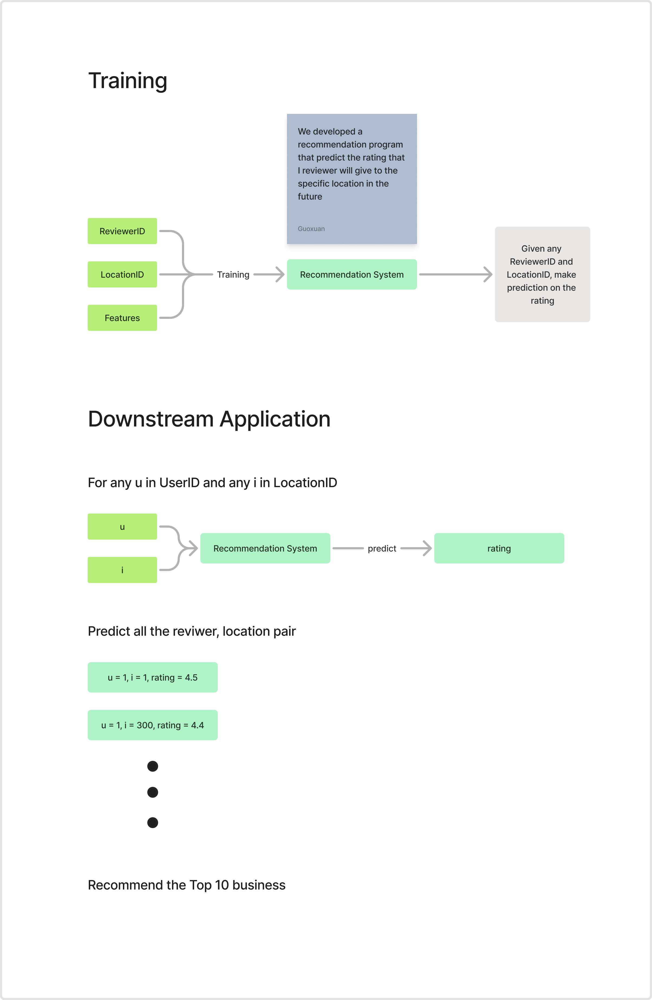

# Recommendation based on Sequential Dynamics for Business owners (RSDB)

[Running Meeting Note](https://docs.google.com/document/d/1wip-kDJHyLVldHFIrES-p2NLOI2Qk7_ww8qfhiIvoc4/edit?usp=sharing)

## Recommendation Structure

## Milestones
1. Four hours per day work:
2. Milestones:
    - `Dec 2, 2024` Start doing writeup
    - `Dec 1, 2024` Finish project
    - `Nov 30, 2024` Basemodel, can be bad models, ready to fine tune.
    - `Nov 28, 2024` EDA all finish, start doing model(EDA简单粗暴)
        - Prioritize cleaning and standardization
        - Dataset can use Hawaii if no choice
        - After this, everyone focus on modeling
    - `Nov 26, 2024` Model 1 & 2 start (Jason & Kevin), make sure not just mathematically, but practically work.
    - `Nov 25, 2024` Data cleaning finish (at least good dat, doesn’t need to be best data)
        - Have a Python file with clean code that preprocesses and give clean data

## assignment requirements
### Dataset
- [ ]  EDA
- [ ]  data set description
    - [ ]  row and cols
    - [ ]  basic statistics
    - [ ]  missing values
    - [ ]  outliers
    - [ ]  size of the data set

### Predictive Task
- [ ]  Problem we are trying to solve
    - [ ]  context
    - [ ]  stakeholder
- [ ]  metrics used to evaluate the model
- [ ]  baseline model
- [ ]  downstream application of the model (validity the performance of the model)
- [ ]  used features

### Model
- [ ]  Used model
    - [ ]  what is the model
    - [ ]  pro and con
    - [ ]  the result
    - [ ]  why using this model
    - [ ]  how did we optimize it
    - [ ]  issue encountered
- [ ]  
- [ ]  strength and weakness

### Literature
- [ ]  related works on the problem
- [ ]  other data set that has been used to train this model
- [ ]  What are state of the art method
- [ ]  your finding against other works

### Results
- [ ]  baseline model comparison
- [ ]  significance of the result
- [ ]  which feature representation works well
- [ ]  interpretation of your model
- [ ]  How does the proposed model succeed

## Reference Sources
1. Dataset:
    - General Information: https://cseweb.ucsd.edu/~jmcauley/datasets.html#google_local
    - Full Dataset: https://datarepo.eng.ucsd.edu/mcauley_group/gdrive/googlelocal/#files
2. Models:
    - General models from textbook: https://cseweb.ucsd.edu/~jmcauley/pml/pml_book.pdf
    - Translational Model: https://cseweb.ucsd.edu/~jmcauley/pdfs/recsys18a.pdf
    - Advance LSTM Model: https://github.com/nijianmo/fit-rec
3. Instructions:
    - A2 Slides: https://cseweb.ucsd.edu/classes/fa24/cse258-b/slides/assignment2_fa24.pdf

## Mathamatics Formulation of Model
1. Summary of the math from FitRec: https://github.com/KevinBian107/TBR/blob/main/math/TBR%20Mathamatical%20Formulation.pdf
2. Intro to Sequential Modeling: https://github.com/KevinBian107/SBRB/blob/main/math/Intro%20to%20Sequential%20Modeling.pdf

## Model in Practice
1. Instruction at https://github.com/KevinBian107/RSDB/tree/main/recommender

## Explorative Data Analysis
1. Refer to https://github.com/KevinBian107/RSDB/bl ob/main/explorative%20data%20analysis/eda.ipynb
2. Instruction at https://github.com/KevinBian107/RSDB/tree/main/explorative%20data%20analysis

