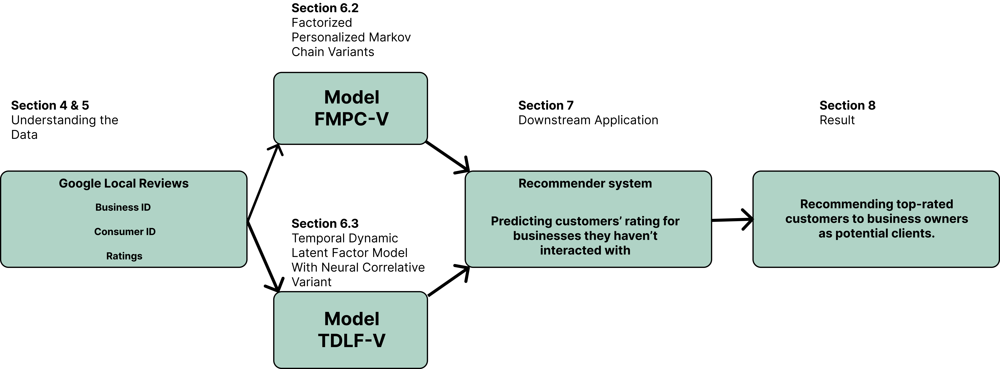

# A Sequential Recommendation System
We are constructing a hybrid recommender system with collaborative filters and content-based filtering. The model will use features of locations, the interaction of location and user, and the temporal evolution of the interaction to predict a user's rating of a business.

## System Flow of RSDB
This is the main flow of our pipeline:



## Structure of System

```bash
rsdb/
├── data/
├── configs/
├── features/
│   ├── featuring.py
├── math_formulation/
├── models/
│   ├── fpmc/
│   ├── tldf/
├── preprocess/
│   ├── data_preprocessing.py
├── eval/
│   ├── eval_processing.py
├── recommendation.py
├── train.py
```

## Reference Sources
1. Dataset:
    - [General Information](https://cseweb.ucsd.edu/~jmcauley/datasets.html#google_local)
    - [Full Dataset](https://datarepo.eng.ucsd.edu/mcauley_group/gdrive/googlelocal/#files)
2. Models:
    - [General models from textbook](https://cseweb.ucsd.edu/~jmcauley/pml/pml_book.pdf)
    - [Translational Model](https://cseweb.ucsd.edu/~jmcauley/pdfs/recsys18a.pdf)
    - [Advance LSTM Model](https://github.com/nijianmo/fit-rec)

## Mathamatics Formulation of Models
1. [Intro to FitRec Mathamatical Formulation](https://github.com/KevinBian107/RSDB/blob/main/math/Intro%20to%20FitRec%20Mathamatical%20Formulation.pdf)
2. [Intro to Sequential Modeling](https://github.com/KevinBian107/RSDB/blob/main/math/Intro%20to%20Sequential%20Modeling.pdf)

